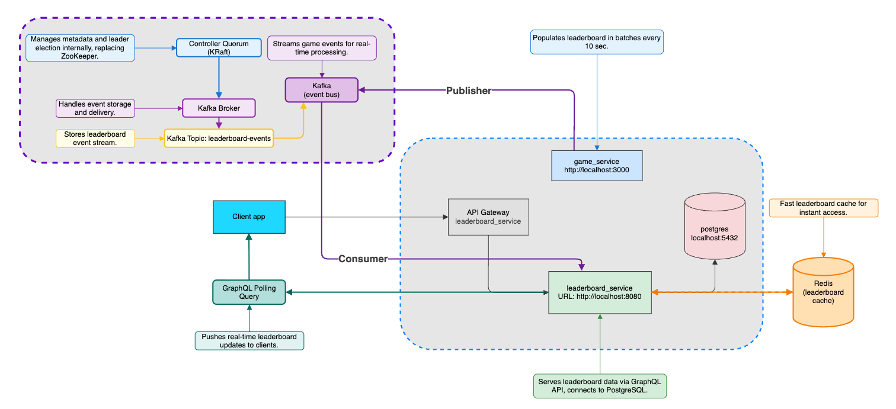
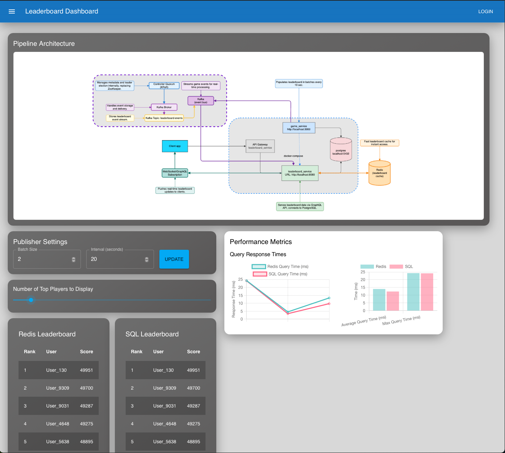

## System Architecture



## Estimation

- **Daily Active Users (DAU):** 5 million
- **Average Users per Second:** 50 (5 million users / 24 hours / 3600 seconds)
- **Peak Users per Second:** 250 (5 times the average)
- **QPS for Scoring a Point:** 500 (assuming 10 games per user per day)
- **Peak QPS for Scoring:** 2500
- **QPS for Fetching Top 10 Leaderboard:** ~50

## Client application



## Running the system

```bash
docker-compose build --no-cache
docker-compose up -d
```

### How KRaft Works: The Royal Kitchen Analogy

To understand how Kafka works without ZooKeeper (in KRaft mode), imagine a royal kitchen:

- **The Kitchen**: The entire Kafka Cluster.
- **The Chefs (Brokers)**: They do the actual work—handling and processing the data (the ingredients and recipes).
- **The Maîtres d' (Controllers)**: They don't cook, but they manage the entire kitchen operation. They hold the "Master Recipe Book" (the cluster's metadata).

**The Old Way (with ZooKeeper):** The Master Recipe Book was kept in a separate library (**ZooKeeper**). The Maîtres d' had to constantly run back and forth, which was slow and created an external dependency.

**The New Way (with KRaft):** The library is gone! The kitchen is now self-sufficient.

- **Controller Quorum**: Instead of one Maître d', there's now a small, elite council of them. They all hold a perfectly synchronized copy of the Master Recipe Book. This provides high availability and fault tolerance.
- **KRaft Protocol**: This is the strict set of rules the council uses to vote on changes and elect a leader (the **Active Controller**). This ensures all decisions are consistent and agreed upon by a majority.

In short, KRaft replaces the external ZooKeeper with an internal, highly-efficient management council that runs the cluster, making Kafka simpler, faster, and more robust.

### Check all kafka topics

`/usr/bin/kafka-topics --list --bootstrap-server localhost:9092`

###

## Run codegen

`go run github.com/99designs/gqlgen generate`

## Create table

`psql -U postgres`

## Create using sql

`docker exec -i leaderboard-postgres-1 psql -U postgres postgres < <Path to migrations folder>/leaderboard_service/migrations/01_update_user_id_type.sql`

## Query the DB

`docker exec -i leaderboard-postgres-1 psql -U postgres postgres < <Path to folder>/leaderboard/leaderboard_service/migrations/check_data.sql`

```sql
CREATE TABLE leaderboard (
  user_id VARCHAR(36) PRIMARY KEY,
  user_name VARCHAR(255) NOT NULL,
  score INTEGER NOT NULL
);
```

## Create docker build without cache
```bash
docker-compose build --no-cache
docker-compose build --no-cache client_application
```

## Build just one microservice

`docker compose up -d --build --no-deps client_application`

## Run docker-compose

`docker-compose up -d`

## Run a specific container
```bash
docker ps
docker exec -it 8b34ff8edc4e bash
```

##

Run mutation and queries

```js
mutation createDummyUser($user_name: String!, $score: Int!) {
  createUser(user_name: $user_name, score: $score) {
    user_id
    user_name
    rank
    score
  }
}

{
  "user_name": "Dummy User",
  "score": 0
}

query {
	leaderboard {
    score
    user_id
    user_name
  }
}
```

## Game service

http://localhost:4000/

```js
query GetLeaderboard {
  leaderboard {
    score
    user_id
    user_name
  }
}
```
